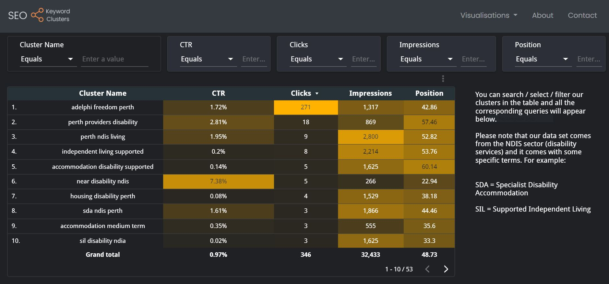
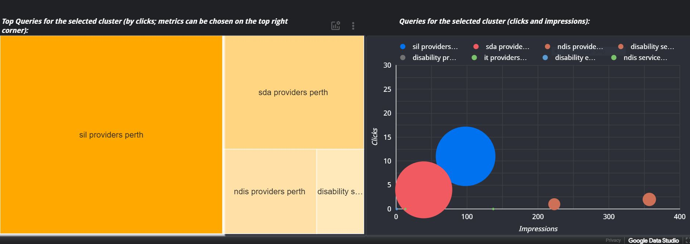
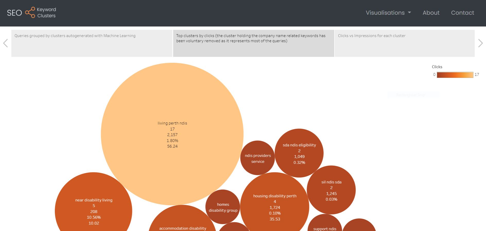

# SEO Keyword Clusters
https://seo-keyword-clusters.herokuapp.com/

An application using Machine Learning to automatically create clusters of queries from Google Search Console. The clusters are also named automatically by the ML model.
The results are being displayed with Google Data Studio and Tableau. 

Note: the current data set is from a NDIS company, so the keywords are related to the disability services. 
The repository can be downloaded and you can use your own dataset. However, you will need to make a few steps:

- Your website needs to be connected to Google Search Console
- You need to create a new google spread sheet (named 'keyword_clustering' in our case, feel free to use a different name)
- Google credentials JSON file (named 'default.json' in our jupyter notebook, feel free to choose a different name) and Google Search Console "Queries.csv" to be added / replaced in the repository.

Here is a guide to create the Google Spreadsheet and access the credentials (to be kept locally!):
https://towardsdatascience.com/google-sheets-pandas-dataframe-6b8666f9cf6

&nbsp;
&nbsp;

&nbsp;

